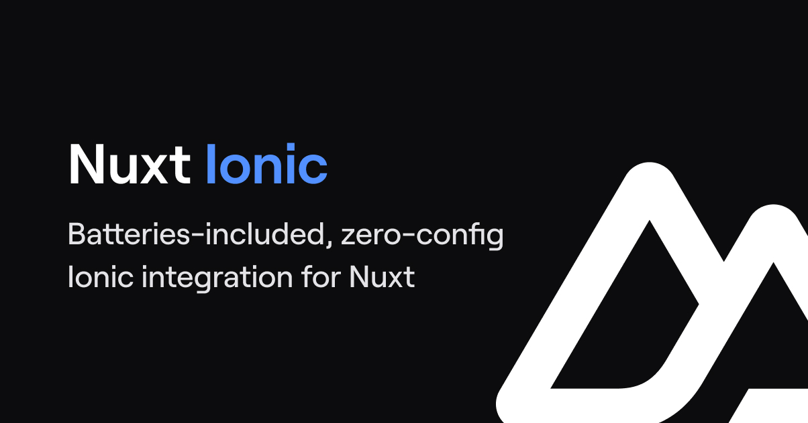

# Nuxt Ionic

[![npm version][npm-version-src]][npm-version-href]
[![npm downloads][npm-downloads-src]][npm-downloads-href]
[![Github Actions][github-actions-src]][github-actions-href]
[![Codecov][codecov-src]][codecov-href]

> [Ionic](https://ionicframework.com/docs/) integration for [Nuxt](https://nuxtjs.org)

- [✨ &nbsp;Changelog](https://github.com/nuxt-modules/ionic/blob/main/CHANGELOG.md)
- [📖 &nbsp;Read the documentation](https://ionic.nuxtjs.org)
- [▶️ &nbsp;Online playground](https://stackblitz.com/github/nuxt-modules/ionic/tree/main/playground)

## Features

**⚠️ `@nuxtjs/ionic` is currently a work in progress. ⚠️**

- Zero-config required
- Auto-import Ionic components, composables and icons
- Ionic Router integration
- Pre-render routes
- Mobile meta tags
- Works out-of-the-box with [Capacitor](https://capacitorjs.com/) to build mobile apps

**In progress**

- [ ] PWA Elements [#14](https://github.com/nuxt-modules/ionic/issues/14)

## Usage

👉 Check out https://ionic.nuxtjs.org.

## 💻 Development

- Clone this repository
- Enable [Corepack](https://github.com/nodejs/corepack) using `corepack enable` (use `npm i -g corepack` for Node.js < 16.10)
- Install dependencies using `pnpm install`
- Stub module with `pnpm dev:prepare`
- Run `pnpm dev` to start [playground](./playground) in development mode

## License

Made with ❤️

Published under the [MIT License](./LICENCE).

<!-- Badges -->

[npm-version-src]: https://img.shields.io/npm/v/@nuxtjs/ionic?style=flat-square
[npm-version-href]: https://npmjs.com/package/@nuxtjs/ionic
[npm-downloads-src]: https://img.shields.io/npm/dm/@nuxtjs/ionic?style=flat-square
[npm-downloads-href]: https://npmjs.com/package/@nuxtjs/ionic
[github-actions-src]: https://img.shields.io/github/actions/workflow/status/nuxt-modules/ionic/ci.yml?style=flat-square&branch=main
[github-actions-href]: https://github.com/nuxt-modules/ionic/actions?query=workflow%3Aci
[codecov-src]: https://img.shields.io/codecov/c/gh/nuxt-modules/ionic/main?style=flat-square
[codecov-href]: https://codecov.io/gh/nuxt-modules/ionic
